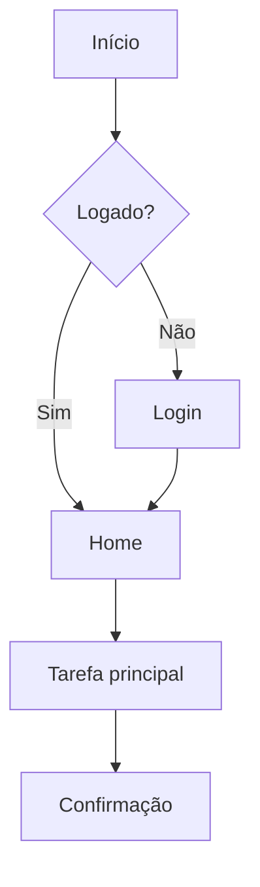

# Arquitetura da Informação (AI)

Organização, estruturação e rotulagem de conteúdo e funcionalidades para que
o usuário encontre o que precisa e entenda onde está.

## Componentes da AI
1. **Organização**: como o conteúdo é agrupado (por tema, tarefa, audiência).
2. **Rotulagem**: nomes claros e consistentes (linguagem do usuário, não interna).
3. **Navegação**: como o usuário se move (global, local, contextual, breadcrumbs).
4. **Busca**: encontrar por consulta quando a navegação não basta.

## Processo
1. **Inventário de conteúdo/entidades**: liste telas, dados e ações.
2. **Agrupamento**: organize em grupos lógicos (card sorting mental).
3. **Hierarquia**: defina níveis (pai/filho), do geral ao específico.
4. **Mapa do site / app**: árvore de telas e suas relações.
5. **Fluxos (user flows)**: caminho do usuário para concluir tarefas-chave.

## Navegação — boas práticas
- Profundidade x amplitude: evite menus muito profundos (>3 níveis).
- Mostre **onde o usuário está** (estado ativo, breadcrumb, título).
- Padrões mobile: tab bar (3–5 itens principais), stack/push, drawer para secundário.
- Rótulos curtos, previsíveis e consistentes em todo o produto.

## Diagramas (use Mermaid)
User flow simples:

## Saída esperada desta etapa
- Mapa do app (árvore de telas).
- Estrutura de navegação.
- User flows das tarefas principais.
- Glossário de rótulos.
